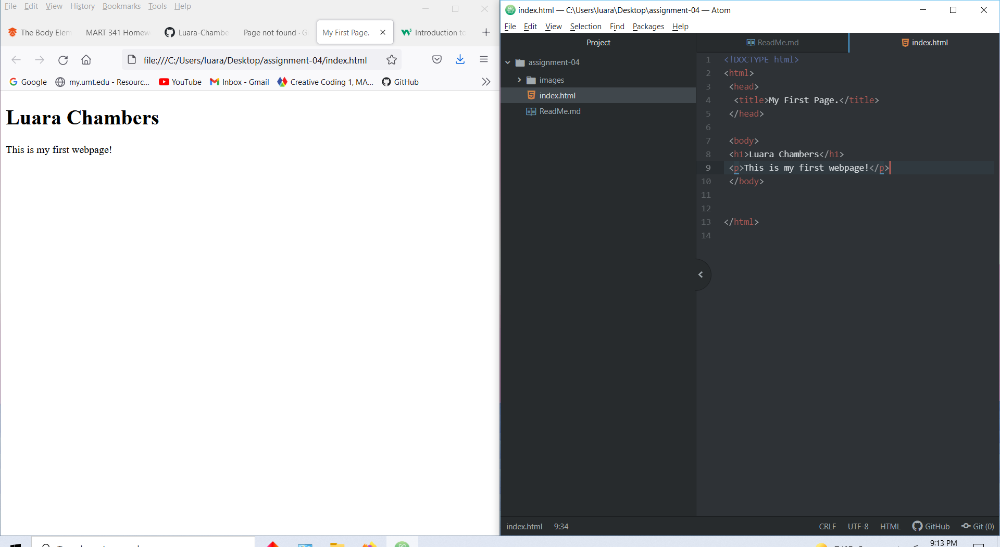

# Assignment 4

## Luara Chambers

Browsers work by displaying the content collected from the severs, by using the different components of the webpage. These include the User Interface, Rendering Engine, Browser Engine, Network, JavaScript interpreters, and Data Storage. Browsers I currently use are Firefox, Google, and Safari.

A markup language such as HTML is a type of style used to create and design the basis of what we know as webpages. They form the foundation that is build upon by using scripts, and code to create almost every known website out there. Other examples include XML and XHTML.

