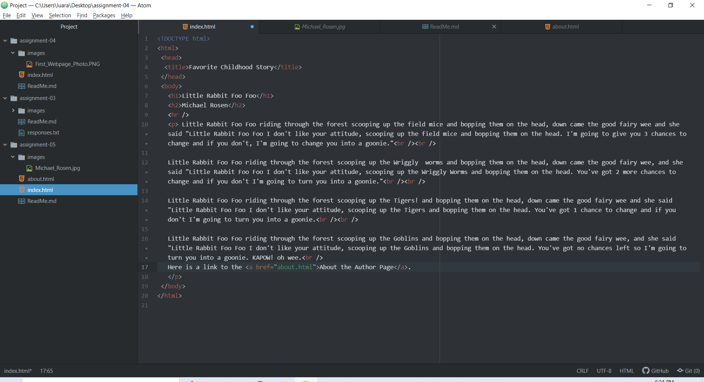

# Assignment 5

## Luara Chambers

Using the Wayback Machine I went back to Pokemon.com and looked at what it appeared to be like 10 years ago. I was surprised at how little of it I remembered. I also noticed the site was much more basic and less flashy then it is now. Originally it was just a news site and now it has all of these games and exciting activities.

With these last few topics I learned how to set up a fairly basic, yet very exciting website. I found it to be very enjoyable when everything clicked together and finally worked. The hardest part for me was figuring out how to get the page links to work, but once I figured it out I was surprised how straight-forward it really was.

